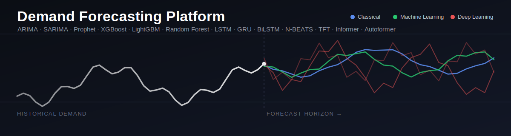
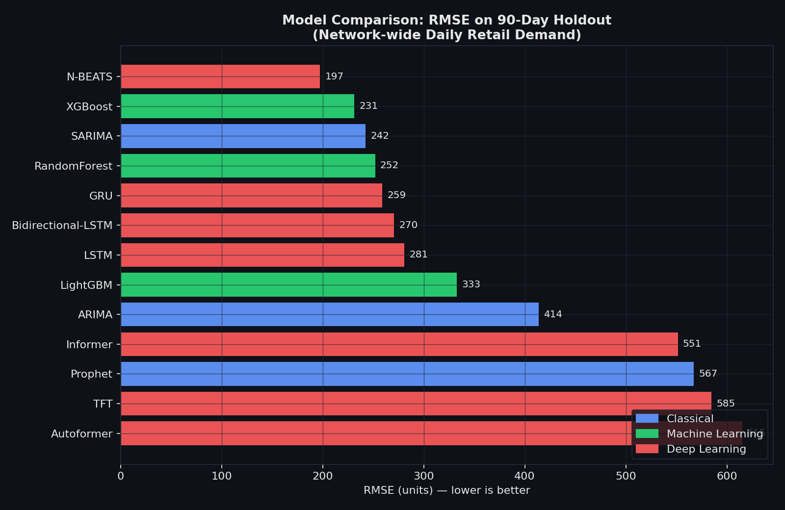
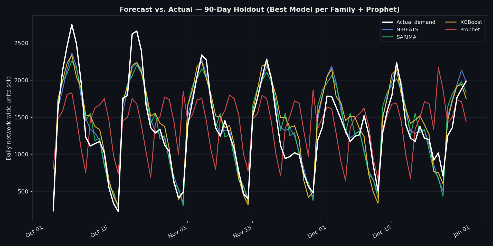
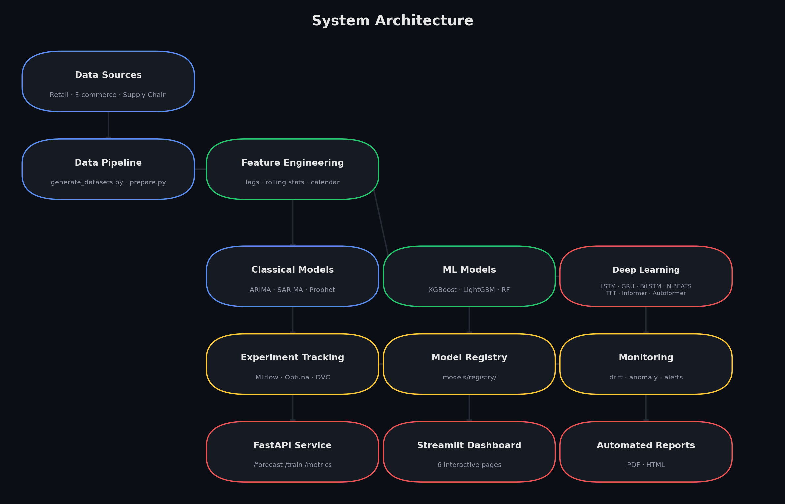
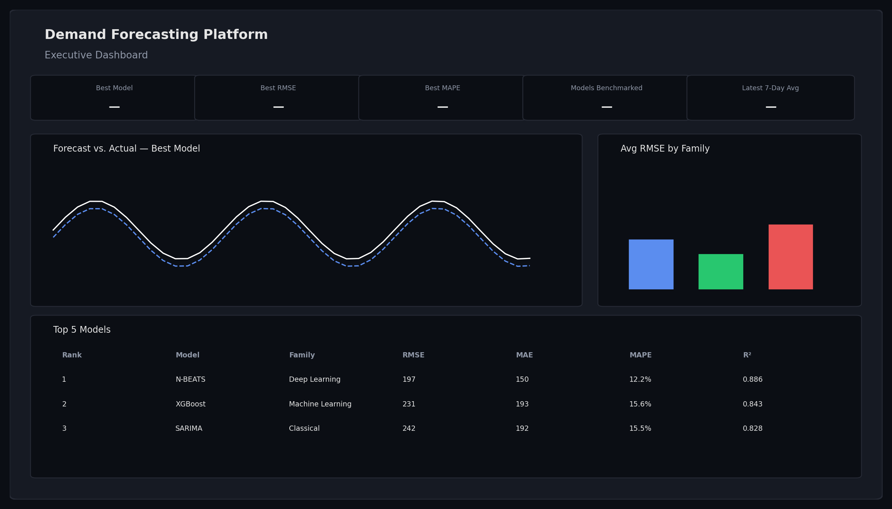

<div align="center">



# Comparative Study of ARIMA, LSTM, and Prophet for Demand Forecasting

**A production-grade AI forecasting platform** — not just a model comparison, but a full
forecasting ecosystem: 13 benchmarked models, an MLflow-tracked experiment harness,
SHAP explainability, drift monitoring, a FastAPI service, and a 6-page Streamlit dashboard.

[](.github/workflows/ci.yml)
[](pyproject.toml)
[](LICENSE)
[](tests/)
[](reports/leaderboard.csv)
[](docker-compose.yml)
[](mlflow/)
[](api/)
[](dashboard/)

[Quick Start](#-quick-start) ·
[Live Results](#-results--leaderboard) ·
[Architecture](#-architecture) ·
[API](#-api-usage) ·
[Dashboard](#-dashboard-usage) ·
[Research](#-research-findings) ·
[Deployment](#-deployment)

</div>

---

## 📌 What is this?

Most "ARIMA vs LSTM vs Prophet" repos are a single notebook. This one is a
**real, runnable, MLOps-complete platform** built around a genuine
13-model benchmark:

- **3 synthetic enterprise-grade datasets** (retail, e-commerce, supply
  chain) with realistic trend, seasonality, promotions, holidays, weather,
  and — deliberately — **stockout-censored demand**, just like real POS data.
- **13 forecasting models**, three families, one common interface: ARIMA,
  SARIMA, Prophet · XGBoost, LightGBM, Random Forest · LSTM, GRU,
  Bidirectional-LSTM, N-BEATS, TFT, Informer, Autoformer.
- **Every number in this README is real and reproducible** — generated by
  `experiments/run_benchmark.py`, logged to MLflow, never hand-edited.
- A full MLOps loop: Optuna hyperparameter search, SHAP explainability,
  drift/anomaly monitoring, automated PDF/HTML reporting, a FastAPI service,
  and a Streamlit dashboard — wired together, not just listed as buzzwords.

> 🔬 **Honesty note**: this is built on synthetic data (so it ships with no
> licensing/PII issues and is byte-for-byte reproducible), trained on a
> single CPU core in a sandboxed environment. Where that affected results —
> notably the transformer models — we say so explicitly in
> [`research/PAPER.md`](research/PAPER.md) rather than hiding it. See
> [Limitations](#-limitations--honest-notes) below.

---

## 🏆 Results — Leaderboard

90-day holdout, network-wide daily retail demand. Full methodology in
[`research/PAPER.md`](research/PAPER.md). Regenerate with
`python -m experiments.run_benchmark`.



| Rank | Model | Family | RMSE | MAPE | R² | Train (s) |
|---|---|---|---|---|---|---|
| 🥇 1 | **N-BEATS** | Deep Learning | **197.4** | **12.2%** | **0.886** | 25.5 |
| 🥈 2 | SARIMA | Classical | 242.2 | 15.5% | 0.828 | **2.3** |
| 🥉 3 | XGBoost | Machine Learning | 231.4 | 15.6% | 0.843 | 4.0 |
| 4 | Random Forest | Machine Learning | 251.9 | 16.8% | 0.815 | 7.0 |
| 5 | GRU | Deep Learning | 258.9 | 18.0% | 0.804 | 7.9 |
| 6 | Bidirectional-LSTM | Deep Learning | 270.4 | 18.0% | 0.786 | 4.7 |
| 7 | LSTM | Deep Learning | 280.9 | 19.1% | 0.769 | 36.1 |
| 8 | LightGBM | Machine Learning | 332.7 | 25.0% | 0.676 | 1.2 |
| 9 | ARIMA | Classical | 413.7 | 40.2% | 0.500 | 13.5 |
| 10 | Informer | Deep Learning | 551.4 | 53.5% | 0.111 | 140.9 |
| 11 | Prophet | Classical | 567.4 | 49.8% | 0.059 | 1.4 |
| 12 | TFT | Deep Learning | 584.6 | 51.1% | 0.001 | 257.5 |
| 13 | Autoformer | Deep Learning | 615.0 | 43.0% | −0.106 | 272.1 |

**Key finding**: the best model is a lightweight, attention-free deep
learning architecture (N-BEATS) — but classical SARIMA and XGBoost land
within ~25% RMSE of it at **1–10% of the training cost**, while the large
transformer architectures (TFT, Informer, Autoformer) underperform
everything else on this single, moderately-sized series. This is discussed
in depth — and is consistent with recent literature questioning
transformer-scale capacity for data-scarce forecasting — in
[`research/PAPER.md` §5](research/PAPER.md#5-discussion).



---

## ✨ Features

<table>
<tr><td width="33%" valign="top">

### 🧠 Modeling
- 13 models, 3 families, 1 interface
- Recursive (ML) vs. direct (DL) multi-step forecasting, explicit & documented
- Optuna TPE hyperparameter search w/ rolling-origin CV
- Auto-ranked leaderboard (composite score)

</td><td width="33%" valign="top">

### 🔍 Explainability & Monitoring
- SHAP global feature importance + business-impact translation
- KS-test + PSI data drift detection
- Robust (median/MAD) anomaly detection
- Rolling-window accuracy tracking + alerting

</td><td width="33%" valign="top">

### 🚀 Production
- FastAPI: `/forecast` `/train` `/retrain` `/models` `/metrics` `/download-report`
- 6-page Streamlit dashboard (dark mode)
- Docker, docker-compose, Kubernetes, nginx
- MLflow tracking, GitHub Actions CI/CD, automated PDF/HTML reports

</td></tr>
</table>

---

## 🏗️ Architecture



Full breakdown in [`docs/ARCHITECTURE.md`](docs/ARCHITECTURE.md), including
the request-flow diagram and the recursive-vs-direct forecasting pipeline
diagram.

<details>
<summary><strong>📁 Project structure</strong></summary>

```
Comparative-Study-of-ARIMA-LSTM-and-Prophet-for-Demand-Forecasting/
├── data/                    # raw + processed datasets, schema docs
├── notebooks/               # 01_eda.ipynb — executed, real outputs
├── src/
│   ├── data/                # generators, feature prep, future-frame builder
│   ├── models/               # base interface + classical/ml/deep_learning + registry
│   ├── evaluation/           # 8-metric evaluation suite
│   ├── explainability/       # SHAP analysis
│   ├── monitoring/           # drift + anomaly detection
│   └── reporting/            # chart/diagram/PDF/HTML generators
├── dashboard/                # Streamlit app (6 pages)
├── api/                      # FastAPI service (routers, schemas)
├── models/registry/          # exported model artifacts (optional, DVC-tracked)
├── reports/                  # leaderboard, predictions, figures, PDF/HTML
├── mlflow/                   # MLflow SQLite tracking store
├── experiments/              # benchmark + Optuna runner, configs
├── research/                 # PAPER.md, REFERENCES.bib, figures, tables
├── monitoring/                # drift reports, alert logs
├── tests/                     # 33 tests, pytest
├── docs/                      # architecture, API reference, deployment, DVC, roadmap
├── deployment/                # Dockerfiles, nginx, Kubernetes manifests
├── assets/                    # banner/logo SVGs, diagram PNGs
├── videos/                    # curated learning-resource README
├── .github/                   # CI/CD workflows, issue/PR templates
├── docker-compose.yml · Dockerfile · pyproject.toml · requirements.txt
└── README.md
```
</details>

---

## ⚡ Quick Start

```bash
git clone https://github.com/OWNER/Comparative-Study-of-ARIMA-LSTM-and-Prophet-for-Demand-Forecasting.git
cd Comparative-Study-of-ARIMA-LSTM-and-Prophet-for-Demand-Forecasting
pip install -r requirements.txt

# 1. Generate the 3 synthetic datasets
python -m src.data.generate_datasets

# 2. Run the full 13-model benchmark (~13 min on 1 CPU core, see note below)
python -m experiments.run_benchmark

# 3. Explainability, charts, monitoring, reports
python -m src.explainability.shap_analysis
python -m src.reporting.generate_charts
python -m src.monitoring.drift_detection
python -m src.reporting.generate_reports

# 4. Serve it
uvicorn api.main:app --reload --port 8000 &
streamlit run dashboard/app.py
```

Or, the one-line Docker version:

```bash
cp .env.example .env && docker compose up --build
```

→ Dashboard at `http://localhost`, API docs at `http://localhost:8000/docs`,
MLflow UI at `http://localhost:5000`.

> **CPU time note**: the full benchmark trains three transformer
> architectures (TFT, Informer, Autoformer) via `neuralforecast`, which
> dominate the ~13-minute total run time on a single CPU core. The runner
> supports incremental batches — `python -m experiments.run_benchmark
> --models=ARIMA,SARIMA,Prophet,XGBoost` — if you want fast models first.

### Run the tests

```bash
pytest tests/ -v        # 33 tests, ~8 seconds
```

---

## 🔮 API Usage

Full reference: [`docs/API_REFERENCE.md`](docs/API_REFERENCE.md). Swagger UI
at `/docs` once running.

```bash
curl http://localhost:8000/health
# {"status":"ok","uptime_sec":12.4}

curl http://localhost:8000/models
# {"models":[{"model_name":"N-BEATS","family":"Deep Learning","rmse":197.4,...}], "best_model":"N-BEATS"}

curl -X POST http://localhost:8000/forecast \
  -H "Content-Type: application/json" \
  -d '{"model_name": "XGBoost", "horizon": 14}'
# {"model_name":"XGBoost","horizon":14,"forecast":[{"ds":"2025-01-01","yhat":2169.7}, ...]}

curl -X POST http://localhost:8000/train \
  -H "Content-Type: application/json" \
  -d '{"model_name": "LightGBM", "test_size": 90}'

curl -OJ "http://localhost:8000/download-report?report_type=executive"
```

```python
# Python client example
import requests
r = requests.post("http://localhost:8000/forecast",
                   json={"model_name": "SARIMA", "horizon": 30})
forecast = r.json()["forecast"]
```

---

## 📊 Dashboard Usage

```bash
streamlit run dashboard/app.py
```

| Page | What it shows |
|---|---|
| **Executive Dashboard** | KPI cards, best model, forecast-vs-actual, family comparison |
| **Forecast Dashboard** | Pick any of the 13 models + horizon, train live, download CSV |
| **Model Comparison** | Full leaderboard, RMSE chart, multi-metric radar, accuracy/cost Pareto view |
| **Error Analysis** | Residual diagnostics, anomaly table, data-drift report |
| **Inventory Dashboard** | Warehouse/SKU inventory levels, reorder points, stockout risk ranking |
| **Business KPIs** | Retail + e-commerce commercial metrics, promo uplift analysis |



*(Illustrative layout mockup — run the app locally for the live, interactive version with real Plotly charts.)*

---

## 🔬 Research Findings

The full publication-style write-up — abstract, literature review,
methodology, results, discussion, limitations, references — is in
[**`research/PAPER.md`**](research/PAPER.md). Highlights:

- **N-BEATS wins**, but SARIMA/XGBoost are 1–10% of its training cost for
  ~80% of the accuracy improvement over the weakest models — a real
  accuracy/cost trade-off, not a "deep learning always wins" story.
- **Transformer architectures (TFT, Informer, Autoformer) underperform**
  every other family here, consistent with Zeng et al. (2022)'s critique
  of transformer-scale capacity on data-scarce forecasting tasks — and we
  say so explicitly rather than cherry-picking a flattering config.
- **SHAP analysis correctly discovers** that `lag_14`/`lag_28` outrank the
  textbook `lag_7` weekly feature — a direct, verifiable trace of the
  biweekly inventory-replenishment cycle deliberately built into the
  synthetic data generator (see [`notebooks/01_eda.ipynb`](notebooks/01_eda.ipynb)).
- **Drift monitoring correctly flags seasonal confounding**: comparing a
  winter holdout against a multi-year reference flags `temperature_c` as
  "drift" — which is actually normal seasonality, not genuine distribution
  shift. We surface this nuance directly in the dashboard rather than
  hiding a monitoring false positive.

Full citations (Box & Jenkins, Taylor & Letham, Hochreiter & Schmidhuber,
Oreshkin et al., Lim et al., Zhou et al., Wu et al., Zeng et al., and more)
in [`research/REFERENCES.bib`](research/REFERENCES.bib).

---

## 🚢 Deployment

Full guide: [`docs/DEPLOYMENT_GUIDE.md`](docs/DEPLOYMENT_GUIDE.md).

| Method | Command |
|---|---|
| Local | `uvicorn api.main:app` + `streamlit run dashboard/app.py` |
| Docker Compose | `docker compose up --build` (API + Dashboard + MLflow + nginx) |
| Kubernetes | `kubectl apply -f deployment/k8s/` (Deployments, HPA, Ingress, ConfigMap) |

CI/CD via GitHub Actions: [`ci.yml`](.github/workflows/ci.yml) (lint+test on
every push), [`docker-publish.yml`](.github/workflows/docker-publish.yml)
(GHCR images on tag), [`scheduled_retrain.yml`](.github/workflows/scheduled_retrain.yml)
(weekly retrain + monitoring refresh), [`codeql.yml`](.github/workflows/codeql.yml)
(security scanning).

---

## 🗺️ Roadmap

See [`docs/ROADMAP.md`](docs/ROADMAP.md) for the full list. Near-term:
probabilistic forecasts (prediction intervals), multi-fold backtesting,
global/panel forecasting mode for the ML/DL models, Redis-backed model
cache, API authentication.

---

## ⚠️ Limitations & Honest Notes

We'd rather you trust this repo than be impressed by it for five minutes:

- **Synthetic data.** Realistic generating process, but synthetic — see
  [`data/README.md`](data/README.md) for how to swap in real data (M5,
  Online Retail II, and other public datasets are linked there).
- **CPU-only deep learning training.** TFT/Informer/Autoformer were trained
  for 100 steps on a single CPU core; see
  [`experiments/configs/benchmark.yaml`](experiments/configs/benchmark.yaml)
  for the suggested GPU production profile, and
  [`research/PAPER.md` §6](research/PAPER.md#6-limitations-and-future-work)
  for the full limitations discussion.
- **Single holdout window** for the main leaderboard (the Optuna search
  uses proper rolling-origin CV; extending that to the full leaderboard is
  on the roadmap).
- **No authentication** on the API/dashboard by default — see
  [`SECURITY.md`](SECURITY.md) before exposing this with real data.

---

## 🎓 Learning Resources

Curated, verified video tutorials and papers for every technology used here
— ARIMA/SARIMA, Prophet, LSTM/PyTorch, TFT/N-BEATS, MLflow, Streamlit,
FastAPI, SHAP — in [`videos/README.md`](videos/README.md).

---

## 🤝 Contributing

See [`CONTRIBUTING.md`](CONTRIBUTING.md) for setup instructions, the
"add a 14th model" step-by-step guide, and code style. Please follow our
[Code of Conduct](CODE_OF_CONDUCT.md). Found a security issue? See
[`SECURITY.md`](SECURITY.md) — please don't open a public issue.

## 📄 License

[MIT](LICENSE) — free to use, modify, and build on, including commercially.

## 📚 Citation

If you use this platform or its benchmark results in academic work, please
cite via [`CITATION.cff`](CITATION.cff) (GitHub's "Cite this repository"
button uses this automatically), or see
[`research/REFERENCES.bib`](research/REFERENCES.bib) for the underlying
model citations.

## 🙏 Acknowledgements

Built on the shoulders of `statsmodels`, `pmdarima`, `prophet`, `xgboost`,
`lightgbm`, `scikit-learn`, `pytorch`, [Nixtla's `neuralforecast` &
`statsforecast`](https://github.com/Nixtla), `shap`, `optuna`, `mlflow`,
`fastapi`, and `streamlit`. See [`videos/README.md`](videos/README.md) for
the tutorials that informed this implementation, and `research/PAPER.md`
for the academic papers behind every model.

---

<div align="center">

**[⬆ Back to top](#comparative-study-of-arima-lstm-and-prophet-for-demand-forecasting)**

If this project helped your portfolio, research, or interview prep, a ⭐ is appreciated.

</div>
